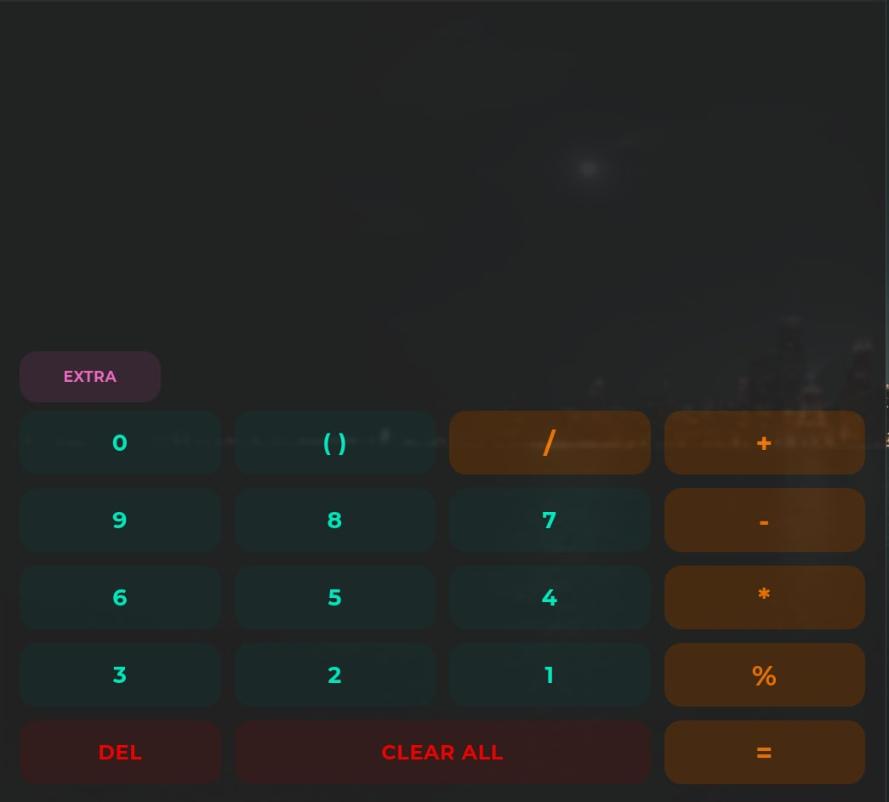

# Calculator - Electron
This app is written in react with library like MUI to replicate my [calculator app](https://github.com/MadFlasheroo7/Calculator) written in kotlin + XML

## Screenshots
| Medium | Large |
|--------|-------|
|||

## Video
<video src="./screenshots/playing%20with%20mui.mp4"></video>

# Thank you
Well i made this app just to try out react and build apps with electron to maybe switch to typescript but even tho i was succesfull with replicating the ui it didnt work so well thus i dont do web dev yet :/