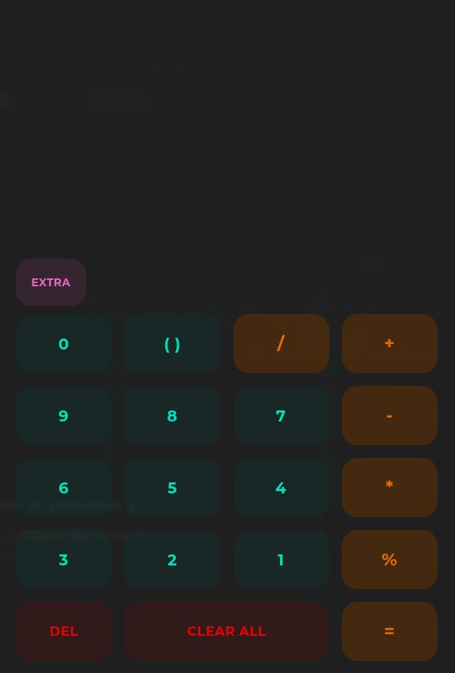

# Calculator - Electron
This app is written in react with library like MUI to replicate my [calculator app](https://github.com/MadFlasheroo7/Calculator) written in kotlin + XML

## Screenshots
| Medium | Large |
|--------|-------|
|||

## Video
https://github.com/MadFlasheroo7/calculator-electron/assets/57130085/96bef981-daaf-4867-b8be-4ee3af3e2c5a

# Thank you
Well, i made this app just to try out react and build apps with electron to maybe switch to typescript but even tho I was succesfull with replicating the ui it didn't work so well thus i dont do web dev yet :/
